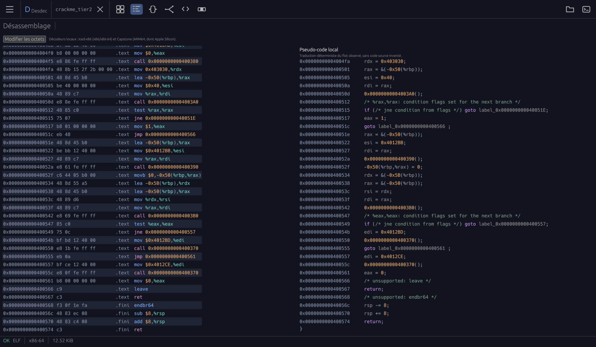
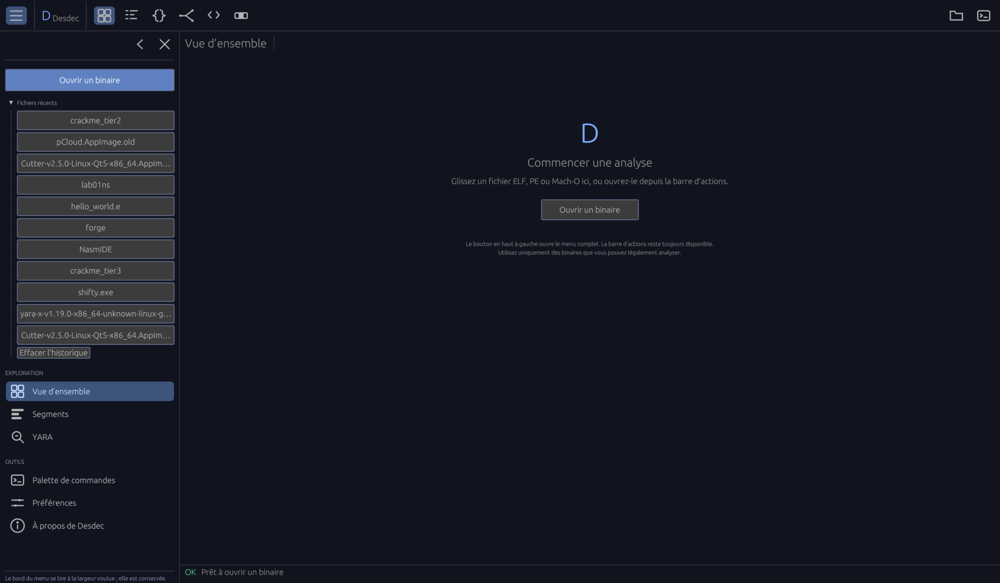
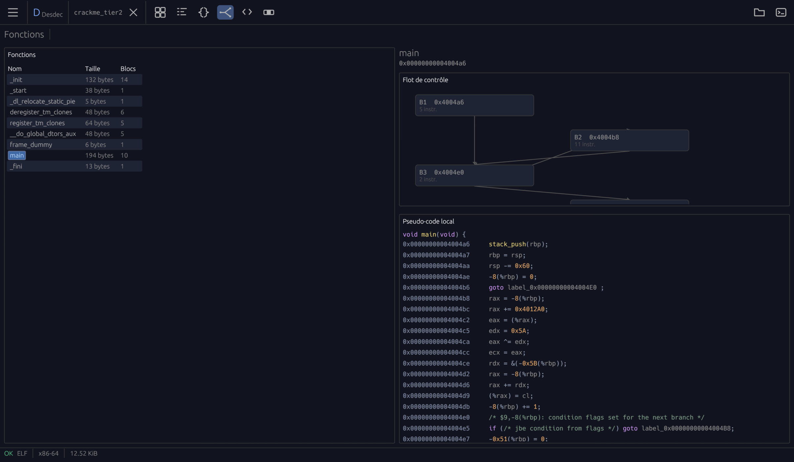
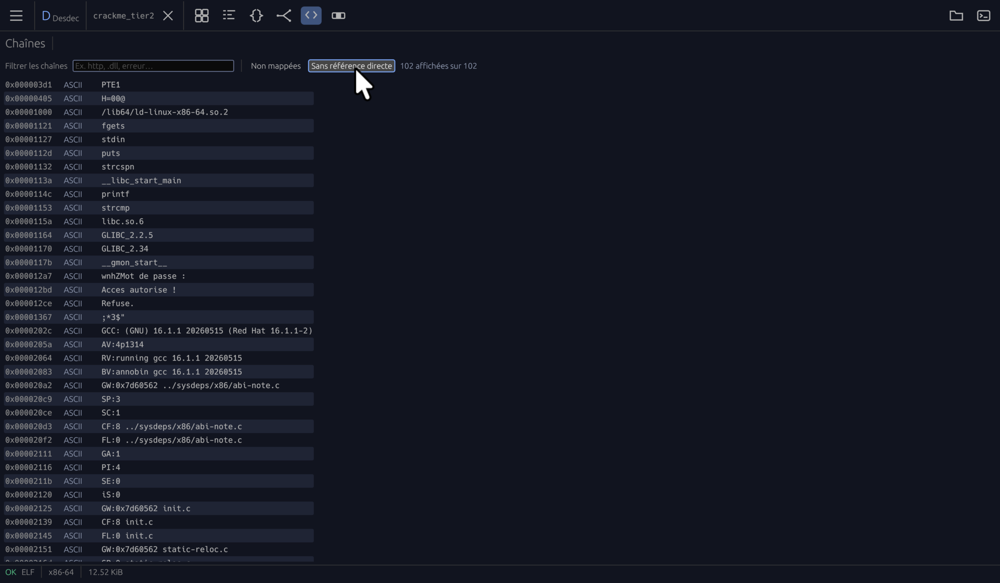
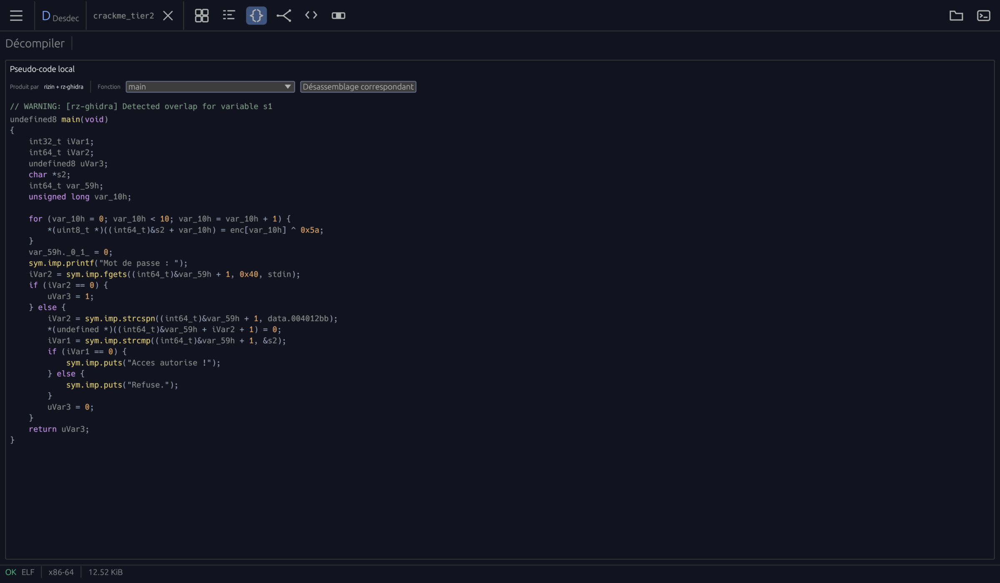
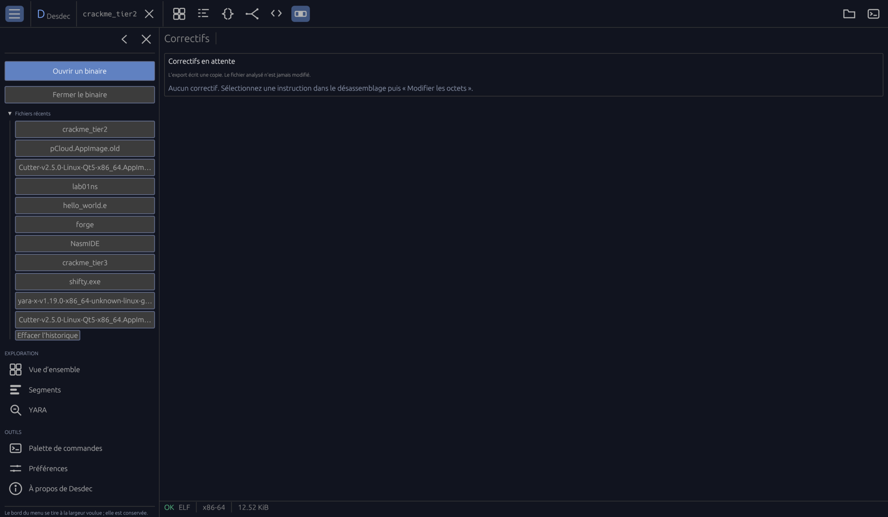
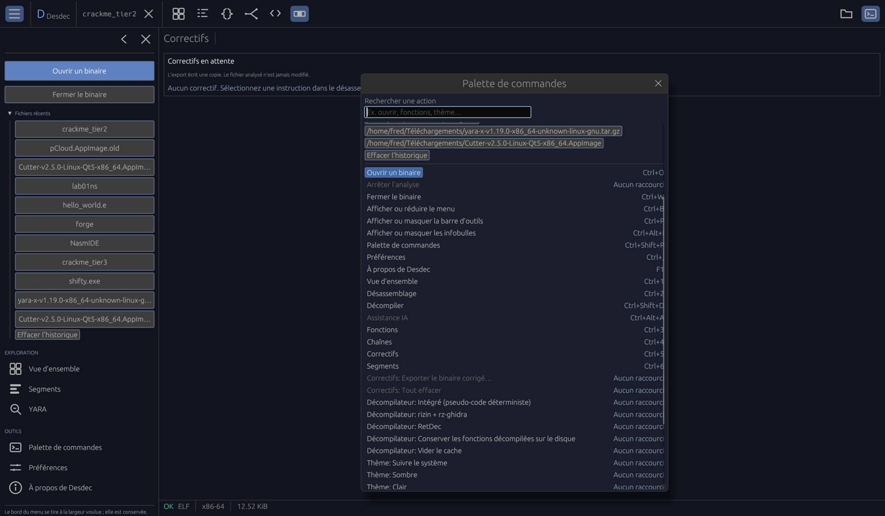
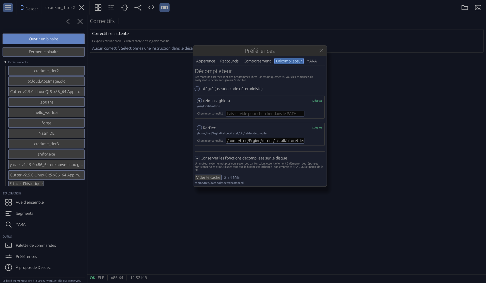

# Desdec

[English](README.md) · [Français](README.fr.md) · **Español**

Las versiones «release» y «pre-release» se firman con una clave privada; actualmente es obligatorio.
La clave pública se distribuye de forma gratuita junto con el binario.  

Desdec es un explorador de binarios local y de código abierto, hecho para leer
los ejecutables que uno tiene derecho a leer. Abre un archivo ELF, PE o Mach-O,
dice qué contiene, y nunca lo ejecuta en su máquina.

Donde sí ejecuta un binario, lo hace en un procesador que él mismo construye:
un emulador sin sistema operativo detrás, descrito más abajo en **Máquina**.
Ningún byte del archivo llega jamás a su propio procesador.

Su regla de conducta es no inventar nada. Cuando una respuesta es exacta —la
dirección que designa un operando, los bytes que escribiría un parche— se da
tal cual. Cuando es una lectura local que una bifurcación puede invalidar, lo
dice. Cuando no lo sabe, también lo dice, en lugar de adivinar.

> Analice y modifique únicamente binarios que le pertenezcan o que esté
> explícitamente autorizado a estudiar.



## Lo que muestra

| Vista | Lo que se encuentra |
| --- | --- |
| **Resumen** | Formato, arquitectura, punto de entrada, SHA-256, entropía, endurecimiento (RELRO, canario, NX, PIE, CFG), lenguaje de origen detectado, y cada biblioteca enlazada —con la explicación de para qué sirve. |
| **Segmentos** | La tabla de secciones: direcciones, tamaños, permisos y entropía por sección, para que una zona comprimida o cifrada salte a la vista. |
| **Funciones** | Las funciones con nombre, su cuerpo, sus bloques básicos y un grafo de flujo de control local. Un clic en una fila abre el código de esa función en el listado. Un archivo que no nombra ninguna tiene igualmente esta vista: sus funciones se encuentran a partir de su propio código — el punto de entrada, todo lo que algo llama, los prólogos de compilador — y cada fila dice de dónde viene, porque una dirección llamada es un hecho y un prólogo una lectura. Junto a cada una: qué la llama, qué llama ella, y las cadenas de llamadas más cortas que llegan hasta ella desde un punto de partida del archivo — la pregunta «¿cómo se llega aquí?», que ni un listado ni una lista de referencias responden por sí solos. |
| **Cadenas** | Las cadenas imprimibles con su desplazamiento y su codificación, filtrables, y las instrucciones que las referencian. |
| **Desensamblado** | Listados x86, x86-64 (iced-x86) y AArch64 (Capstone), con edición de los bytes de una instrucción. Con el botón derecho se explica qué designa el operando y qué escribió por última vez en cada registro nombrado. La barra lleva las banderas de condición de la fila seleccionada —las que establece, las que consulta, y aquellas cuyo valor fijan los bytes pasara lo que pasara antes— y una fila sobre la que usted ha escrito se marca al margen. |
| **Pseudocódigo** | Una traducción prudente del flujo decodificado, integrada en la herramienta —o la salida de Rizin/rz-ghidra o de RetDec si alguno está instalado y elegido. |
| **Máquina** | Un procesador emulado, apagado hasta que pida uno. Registros, memoria, pila, puntos de interrupción, vigilancias, paso a paso detallado/por procedimientos/para salir, ejecución hasta el cursor y pila de llamadas: todo ello mediciones, porque algo se ejecutó de verdad. Corre en un procesador que Desdec construye, nunca en el suyo: ningún byte del archivo llega al procesador de su máquina, y una llamada al sistema, una biblioteca ausente o una instrucción no emulada detienen la ejecución y se nombran en lugar de adivinarse. x86 y x86-64. Los registros XMM son visibles, y los movimientos SSE comunes de 128 bits (`movaps`, `movups`, `movdqa`, `movdqu`) y los XOR (`pxor`, `xorps`) se ejecutan con estado exacto, también al retroceder; las instrucciones YMM/ZMM más anchas siguen deteniéndose y se nombran. Los puntos de interrupción llevan condiciones (`rcx == 4`, `[rdi]:1 != 0`) y un número de pasos a dejar pasar, de modo que uno dentro de un bucle de diez mil vueltas vale la pena. Los espacios del marco — lo que un depurador llama variables locales — se leen del código de la función donde se detuvo la ejecución: cada `-0x14(%rbp)` y cada `0x8(%rsp)` que toca, con su ancho, cuántas veces se lee y se escribe, y lo que la ejecución puso realmente allí. Y la ejecución va **hacia atrás**: se conserva el estado anterior a cada instrucción, así que retroceder lo restaura exactamente — incluso para salir de un fallo, algo que un depurador conectado a un proceso no puede hacer en absoluto. |
| **Grafo** | Una función dibujada como su flujo de control: sus bloques básicos, y las flechas entre ellos con su razón — la rama tomada, la que no lo es, un salto, la continuación del listado. Un `ret` va a un lugar perfectamente conocido y por eso no tiene flecha; un salto por registro tampoco la tiene, y se dice de otro modo, porque las dos cosas no son lo mismo. |
| **Estructuras** | Qué significan los bytes en una dirección. Un archivo no dice casi nada sobre sus propios datos: el listado escribe `mov 0x18(%rbx),%rax`, y qué son esos ocho bytes es su conocimiento, no el suyo. Escríbalo una vez en C — estructuras, uniones, enumeraciones, `typedef`, punteros, arreglos, campos de bits; un encabezado se pega tal cual — y se aplica sobre la memoria de la Máquina mientras corre, y sobre los bytes del archivo si no. La disposición se calcula contra la forma del archivo abierto, incluido el `long` de cuatro bytes que un PE de 64 bits usa donde un ELF usa ocho. Y una estructura se **deduce del código que la recorre**: cada `0x18(%rbx)` de una función es un miembro en ese desplazamiento, lo que nada toca se nombra como relleno, y lo que el código no dice — la longitud de un arreglo, el ancho de un acceso — se informa aparte en vez de inventarse. |
| **Parches** | Las modificaciones de bytes pendientes, y la exportación que las escribe en una **copia**. El archivo analizado nunca se modifica. |
| **Actualizaciones** | Opcionales, y apagadas hasta que usted diga lo contrario. Desdec puede preguntar a GitHub si existe una versión más reciente; la pregunta se hace una vez, y sus respuestas son «sí» y «ahora no» — apagarlo definitivamente se hace en las preferencias. Una descarga se compara con la huella `.sha256` que publica la release, y se rechaza si no coincide. Desdec nunca se reemplaza a sí mismo: el archivo llega a una carpeta, y usted lo abre cuando quiera. |
| **YARA** | Opcional. Ejecuta un `yara` o `yr` instalado localmente sobre el archivo abierto, con sus propias reglas. Desactivado por defecto. |
| **Asistencia de IA** | Opcional, desactivada por defecto. Un modelo relee lo decodificado —un binario entero, una función, una instrucción— y su respuesta se etiqueta como lectura propuesta, nunca como hallazgo. Un modelo local (Ollama) o la API de Anthropic, según lo que configure. |
| **Script** | La regla del lector, escrita una vez y pasada sobre todo el archivo: nombrar cada función más larga que una página, marcar cada llamada a una biblioteca, encontrar aquello a lo que el listado no se desplaza. Se ejecuta en un recinto aislado sin sistema de archivos, sin red y sin procesos: solo el análisis que se le entrega. |
| **Complementos** | Un script escrito por otra persona, instalado como una carpeta con un manifiesto. Ese manifiesto *solicita* permisos —escribir notas, mover el listado, proponer parches— y la lista se le muestra antes de activar nada. Un complemento que nunca se activó nunca se ha ejecutado. |

Todo está disponible en francés, inglés y español, desde una paleta de comandos
(`Ctrl+Mayús+P`) cuyos atajos se pueden reasignar.

## Capturas de pantalla

Aquí la interfaz está en francés; el inglés y el español están a una
preferencia de distancia.

**Antes de abrir un archivo.** El menú conserva los archivos recientes y las
vistas; la barra de acciones sigue disponible, esté el menú abierto o plegado.



**Funciones.** Las funciones con nombre, su tamaño y su número de bloques, el
grafo de flujo de control local de la seleccionada, y su pseudocódigo debajo.
La flecha al principio de una fila —o el botón junto a la dirección— abre el
código de esa función en el listado.



**Cadenas.** Cada cadena imprimible con su desplazamiento y su codificación,
filtrable, y reducible a las que no están mapeadas o nunca se referencian.



**Decompilador externo.** Rizin con rz-ghidra, o RetDec, cuando alguno está
instalado y elegido —el motor que produjo el texto siempre se nombra, y el
desensamblado correspondiente está a un botón.



**Parches.** Las modificaciones de bytes esperan aquí hasta la exportación, y
la exportación escribe una copia: el archivo analizado nunca se modifica.



**Paleta de comandos** (`Ctrl+Mayús+P`). Todos los comandos, su atajo y los
archivos abiertos recientemente, en una sola lista buscable.



**Preferencias.** Los motores externos se buscan en el `PATH` o se apuntan con
una ruta propia, y solo se ejecutan una vez que se selecciona uno.



## Instalar y ejecutar

El script de instalación descarga el archivo publicado para su máquina,
comprueba su SHA-256 *y* su firma, y solo entonces coloca el binario. En Linux
y macOS (Apple Silicon):

```sh
curl -fsSL https://raw.githubusercontent.com/fredza/Desdec/main/scripts/install.sh -o install.sh
less install.sh   # es corto, y está a punto de ejecutarlo
bash install.sh   # instala en ~/.local/bin
```

En Windows (x86-64), el mismo script en PowerShell — sin necesidad de un shell
POSIX:

```powershell
irm https://raw.githubusercontent.com/fredza/Desdec/main/scripts/install.ps1 -OutFile install.ps1
notepad install.ps1   # es corto, y está a punto de ejecutarlo
.\install.ps1        # instala en %LOCALAPPDATA%\Programs\Desdec
```

Ambos aceptan `--version` / `-Version v0.3.36` para una versión concreta,
`--prefix` / `-Prefix` para instalar en otro sitio, y `--from-source` /
`-FromSource` para compilar aquí mismo; `--help` y `Get-Help .\install.ps1`
enumeran el resto. Una versión cuya suma o firma no coincide se descarta, en
lugar de instalarse con un aviso encima. Comprobar una firma necesita `gpg`
—Gpg4win en Windows— y sin él el script se detiene en vez de instalar algo que
no ha podido comprobar.

### Desde las fuentes

Rust 1.85 o posterior.

```sh
git clone https://github.com/fredza/Desdec.git
cd Desdec
cargo run --release -p desdec-app            # abrir la ventana
cargo run --release -p desdec-app -- /bin/ls # o analizar un archivo de inmediato
```

También se puede arrastrar un binario a la ventana, o usar **Abrir un binario**
(`Ctrl+O`).

El flujo de trabajo `Platform binaries` publica archivos precompilados para
Windows x86-64, macOS Apple Silicon y Linux x86-64 en cada etiqueta que empieza
por `v`, junto con sus sumas SHA-256.

### Comprobar una versión publicada

Cada archivo está firmado por **Frédéric Zawalski @2026 bdom**, con la clave
`C9A3 1D07 46E0 65C4 E2EA  33F6 08FA 1D81 8A91 F329`. La clave pública viaja
con los binarios: se adjunta a cada versión con el nombre
`desdec-signing-key.asc`, y también está en la raíz del repositorio.

```sh
gpg --import desdec-signing-key.asc
gpg --verify desdec-linux-x86_64-release.tar.gz.asc \
             desdec-linux-x86_64-release.tar.gz
```

La suma SHA-256 responde a otra pregunta: dice que la descarga está íntegra, no
quién la produjo. La firma dice ambas cosas. La clave privada nunca sale de la
máquina del mantenedor; el servicio de compilación no la tiene, solo compila.

## Qué hace con sus archivos y con su máquina

- **Nunca ejecuta el binario analizado.** Nada de él se lanza, ni se mapea, ni
  se carga.
- **Lee, y solo escribe donde usted lo pide.** El archivo analizado se abre en
  modo lectura; un parche se escribe en una copia aparte que usted mismo
  nombra.
- **No establece ninguna conexión de red mientras usted no configure una.**
  Tal como viene, no se conecta a nada. La asistencia de IA opcional es la
  única excepción, y solo tras elegir un proveedor: un modelo local en la
  interfaz de bucle, o la API de Anthropic por internet. Aun así, lo que sale
  son los datos extraídos —instrucciones, nombres de símbolos, cadenas—, nunca
  el archivo, y la vista muestra el texto exacto antes de que usted pregunte.
- **Cada byte ejecutable leído se decodifica**: no hay tope alguno en el
  número de instrucciones. Una biblioteca compartida grande alcanza realmente
  dieciocho millones, y el listado está virtualizado: su longitud no le cuesta
  nada a la interfaz.
- Lo que sigue acotado es la lectura: como máximo 256 MiB por archivo, 20 000
  cadenas, 4 096 entradas de sección. Cuando se alcanza un límite, la interfaz
  lo dice, en lugar de presentar un listado parcial como si fuera todo el
  programa.
- Los únicos programas externos que inicia son los que usted elige: un
  descompilador (`rizin`, `retdec-decompiler`), YARA o un servidor de modelo
  local. Ninguno es obligatorio, y ninguno se inicia sin haber sido
  seleccionado en las preferencias.
- **Un script no alcanza nada más que el análisis.** El motor de scripts
  recibe el binario decodificado y las notas tomadas sobre él; ni sistema de
  archivos, ni red, ni procesos figuran en su vocabulario, no por una regla que
  pudiera olvidarse, sino porque nunca se registró ninguno. Un script venido de
  fuera se ejecuta exactamente con los permisos que usted le concedió, y aquel
  cuyo manifiesto empieza a pedir más se detiene hasta que usted haya visto la
  nueva lista.
- **Una clave de API nunca se escribe en el archivo de preferencias.** La clave
  de Anthropic se lee de `ANTHROPIC_API_KEY`, o de un archivo que usted indique
  y cuyos permisos le pertenecen.

### Dónde guarda sus cosas

| | Preferencias | Descompilaciones en caché |
| --- | --- | --- |
| Linux | `$XDG_DATA_HOME/desdec/app.ron` o `~/.local/share/desdec/app.ron` | `$XDG_CACHE_HOME/desdec/decompiled` o `~/.cache/desdec/decompiled` |
| macOS | `~/Library/Application Support/Desdec/app.ron` | `~/Library/Caches/desdec/decompiled` |
| Windows | `%APPDATA%\Desdec\data\app.ron` | `%LOCALAPPDATA%\desdec\decompiled` |

Las preferencias se escriben una fracción de segundo después de dejar de
cambiar, y se vuelcan al disco en ese momento —sin esperar a un guardado
periódico ni a un cierre limpio. Una ventana cerrada de golpe en Windows perdía
el tema elegido instantes antes; ya no es así. La persistencia puede
desactivarse por completo, lo que también borra lo ya guardado. Las
descompilaciones se almacenan en caché bajo el SHA-256 del archivo del que
provienen: un archivo truncado, que no tiene una huella fiable, nunca se
almacena.

Otras dos carpetas le pertenecen a usted más que a la aplicación, y ninguna es
una caché: las notas tomadas sobre un binario viven en `desdec/notes`, un
archivo por binario nombrado según su SHA-256 y no según su ruta, y los
complementos viven en `desdec/plugins`, una carpeta cada uno. La ventana de
complementos muestra la ruta exacta en su máquina, y `examples/plugins` en este
repositorio contiene uno para copiar allí.

## Desarrollo

```sh
cargo test --workspace
cargo clippy --workspace --all-targets
cargo fmt --all
```

La batería de pruebas tarda unos veinte segundos y no exige nada instalado.
Analiza binarios ELF, PE y Mach-O AArch64 sintéticos, forjados byte a byte en
`desdec-core::fixtures`: así, los lectores de los formatos que la máquina
anfitriona no usa se ejercitan en cada ejecución, en todas las plataformas.

Para revisar el juego de iconos tras modificar un glifo:

```sh
DESDEC_ICON_SHEET=/tmp/icons.svg cargo test -p desdec-app icon_sheet
```

### Organización

- `crates/desdec-core` — inspección y análisis de binarios. No sabe nada de
  ninguna interfaz. La lectura de entradas no confiables es acotada y total:
  cada lectura pasa por accesores comprobados, cada recorrido de tabla tiene
  tope, y ninguna entrada puede provocar un pánico.
- `crates/desdec-app` — la aplicación nativa `egui`.
- `docs/ARCHITECTURE.md` — el sentido de las dependencias y lo que queda
  deliberadamente fuera del núcleo.

## Licencia

Apache-2.0 O MIT, a su elección: [LICENSE-APACHE](LICENSE-APACHE) y
[LICENSE-MIT](LICENSE-MIT). Ambas son accesibles también desde la ventana
Acerca de, de modo que los términos se alcanzan desde la propia aplicación.

Salvo que usted indique lo contrario, cualquier contribución que envíe
deliberadamente para su inclusión en este trabajo tendrá licencia doble como
arriba, sin términos ni condiciones adicionales.
